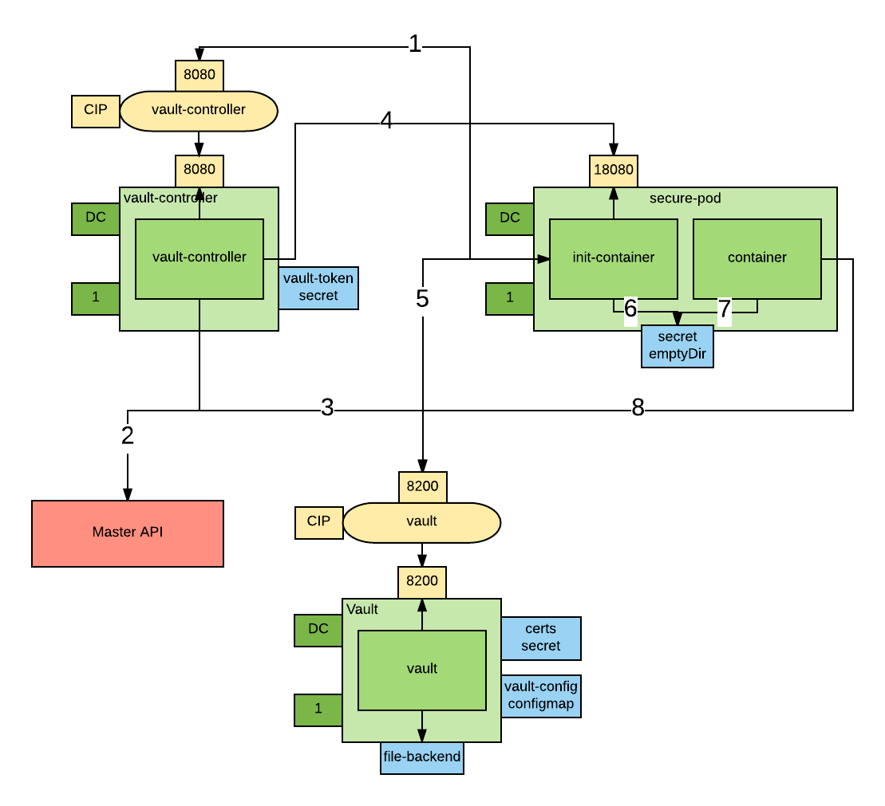

# Vault-based Credential Management Workflow

This project implements the workflow illustrated in the following picture



1. An Init container requests a wrapped token from the Vault Controller
2. The Vault Controller retrieves the Pod details from the Kubernetes API server
3. If the Pod exists and contains the `vaultproject.io/policies` annotation a unique wrapped token is generated for the Pod.
4. The Vault Controller "callsback" the Pod using the Pod IP obtained from the Kubernetes API.
5. The Init container unwraps the token to obtain a dedicated Vault token.
6. The dedicated token is written to a well-known location and the Init container exits.
7. Another container in the Pod reads the token from the token file.
8. Another container in the Pod renews the token to keep it from expiring.

This project is based on Kelsey Hightower's Kubernetes - Vault integration [proof of concept](https://github.com/kelseyhightower/vault-controller)

# Motivation

There is a need to improve how credentials are managed in Kubernetes. Credentials are supposed to be managed with secretes but secrets have some limitations. here is a secret threat model and relative needed security controls:

1. Secrets must be stored securely. Secrets should be encrypted when at rest.
2. Secrets must be transmitted securely among the platform components and the final consumer. Secrets should be encrypted when in transit.
3. Secrets should be visible only to subjects who have a need to know reason. In Kubernetes and Openshift it is relatively easy to get a view permission on secret, more granular control is needed there. For example a cluster admin can see the secrets of all of its tenants even if he/she clearly doesn't have a need to know.
4. Secrets should not be accessible when in use. Today, because secrets are provisioned via a mounted file system, a node administrator can see all secrets of all pods running on that node. Also a someone who RSHs to the pod can see the secrets. 

This project implements an orchestration which tries to mitigate all the above issues.

# Use cases

This project support 2 use cases:

1. a vaut-aware app needs to be injected securely a token with which it can interact with Vault. This is recommended use case for green field scenarios.
2. a vault un-aware app needs to be injected a secret. This is the recommended use case for brown field scenarios.

# Threat model

| attack vector  | use case 1  | use case 2  | openshift secrets  |
|---|---|---|---|
| reading secrets at rest  | ok  | ok  | no  |
| reading secrets in transit  | ok  | ok  | ok  |
| reading secrets via the API  | ok  | ok  | no  |
| reading secrets in use from within the container (rsh)  | ok  | no  | no  |
| reading secrets in use from the node  | ok  | no  | no  |

# Requirements
You need the [Vault CLI](https://www.vaultproject.io/docs/install/) installed on your machine.

# Create a new project
```
oc new-project vault-controller
```

# Install Vault
```
oc adm policy add-scc-to-user anyuid -z default
oc create configmap vault-config --from-file=vault-config=./openshift/vault-config.json
oc create -f ./openshift/vault.yaml
oc create route reencrypt vault --port=8200 --service=vault
```
# Initialize Vault
```
export VAULT_ADDR=https://`oc get route | grep -m1 vault | awk '{print $2}'`
vault init -tls-skip-verify -key-shares=1 -key-threshold=1
```
Save the generated key and token. 

# Unseal Vault.
 
You have to repeat this step every time you start vault. 

Don't try to automate this step, this is manual by design. 

You can make the initial seal stronger by increasing the number of keys. 

We will assume that the KEYS environment variable contains the key necessary to unseal the vault and that ROOT_TOKEN contains the root token.

For example:

`export KEYS=tjgv5s7M4CtMeUz92dU9jV3EudPawgNz6euEnciZoFs=`


`export ROOT_TOKEN=1487cceb-f05d-63be-3e24-d08e429c760c`


```
vault unseal -tls-skip-verify $KEYS
```

# Install Vault Controller

Deploy the vault controller
```
oc create secret generic vault-controller --from-literal vault-token=$ROOT_TOKEN
oc adm policy add-cluster-role-to-user view system:serviceaccount:vault-controller:default
oc create -f ./openshift/vault-controller.yaml
```
You can now start using this orchestration to provision secrets. 

# Examples

See also the following examples:

1. [spring-based vault-aware application](./examples/spring-example/README.md)
2. [spring-based vault-unaware (legacy) application](./examples/spring-legacy-example/README.md)

# Further Improvements 

1. secure all connections with SSL - done
2. use an in memory emptyDir to not leave traces of the secret in the node filesystem - done
3. move the authorization labels to a custom API object so that the pod author cannot authorize his pods - in progress
4. support the case where the init-container retrieves the secret as opposed to just a wrapped token that can get the secret (for legacy apps that cannot be modified to talk to Vault - done
5. add a spring vault example(s) - done
6. refactor code to be more cloud friendly: single CLI with [cobra](https://github.com/spf13/cobra) CLI management and [viper](https://github.com/spf13/viper) properties management - done


# Enable kuberntes native Vault integration

configure kubernetes backend
```
oc create sa vault-auth
oc adm policy add-cluster-role-to-user system:auth-delegator vault-auth
secret=`oc describe sa vault-auth | grep 'Tokens:' | awk '{print $2}'`
token=`oc describe secret $secret | grep 'token:' | awk '{print $2}'`
pod=`oc get pods | grep vault | awk '{print $1}'`
oc exec $pod -- cat /var/run/secrets/kubernetes.io/serviceaccount/ca.crt >> ca.crt
export VAULT_TOKEN=$ROOT_TOKEN
vault auth-enable -tls-skip-verify kubernetes
vault write -tls-skip-verify auth/kubernetes/config token_reviewer_jwt=$token kubernetes_host=https://kubernetes.default.svc:443 kubernetes_ca_cert=@ca.crt
rm ca.crt
vault write -tls-skip-verify auth/kubernetes/role/demo bound_service_account_names=default bound_service_account_namespaces='*' policies=default ttl=1h 
```
test the default account
```
secret=`oc describe sa default | grep 'Tokens:' | awk '{print $2}'`
token=`oc describe secret $secret | grep 'token:' | awk '{print $2}'`
vault write -tls-skip-verify auth/kubernetes/login role=demo jwt=$token
```
The output of the last comment should be a vault token that can subsequently spent to get other secrets.

see the spring integration demo for how to use this with a spring app.

